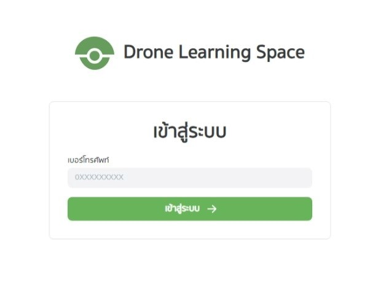
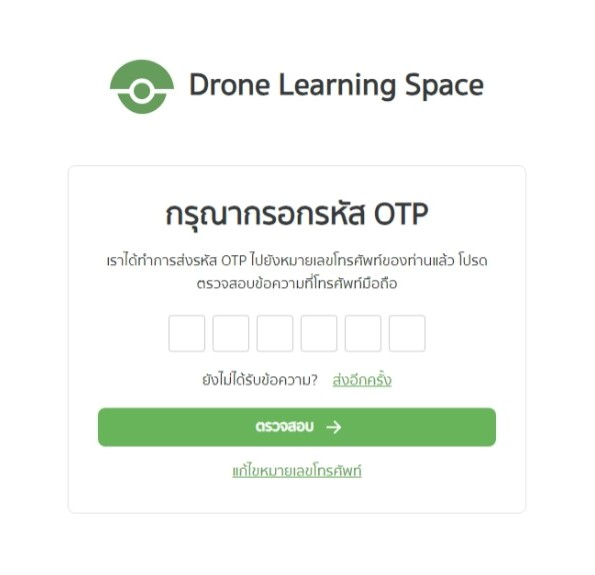
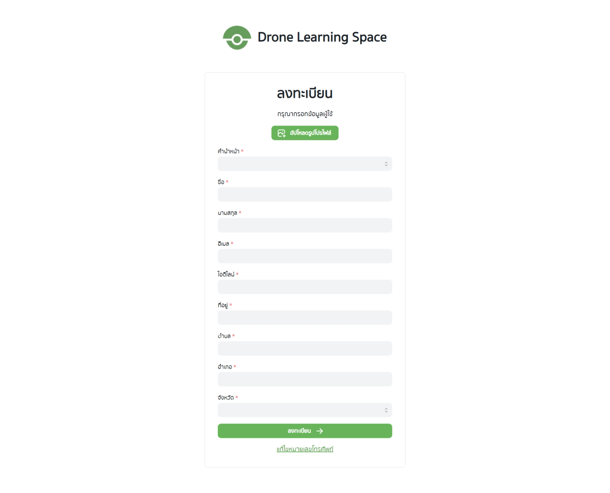
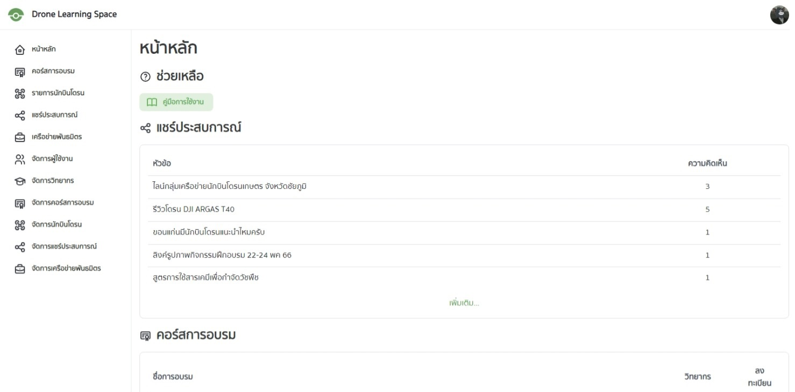

# การเข้าสู่ระบบ

ไปที่หน้าเข้าสู่ระบบ `/login`

สมาชิก นักบินโดรน หรือแอดมิน สามารถเข้าสู่ระบบได้ที่หน้าเข้าสู่ระบบ ด้วยการกรอกเบอร์โทรศัพท์ของตนเอง และคลิกที่ปุ่ม "เข้าสู่ระบบ"

ระบบจะทำการส่งรหัส OTP ไปยังเบอร์โทรศัพท์ที่เข้าสู่ระบบ เพื่อยืนยันเบอร์โทร

หากผู้ใช้งานต้องการรหัส OTP ใหม่ ผู้ใช้งานสามารถคลิกที่ข้อความ "ส่งอีกครั้ง" เพื่อส่ง OTP ใหม่อีกครั้งได้
และหากผู้ใช้งานต้องการแก้ไขเบอร์โทรศัพท์ ผู้ใช้งานสามารถคลิกที่ข้อความ "แก้ไขหมายเลขโทรศัพท์" เพื่อกลับไปยังหน้าเข้าสู่ระบบอีกครั้ง

> สำหรับการทดลองใช้งาน (Demo) ระบบจะไม่ส่ง OTP ให้ ให้ผู้ใช้กรอก OTP เป็น 000000 เพื่อเข้าสู่ระบบ

หากเป็นการเข้าสู่ระบบครั้งแรก ผู้ใช้งานจะพบกับหน้าลงทะเบียน ผู้ใช้งานต้องทำการกรอกข้อมูลส่วนตัวของตัวเองก่อน จึงจะสามารถเข้าใช้งานได้

เมื่อเข้าสู่ระบบได้แล้ว จะมายังหน้าหลักของแอปพลิเคชัน

โดยหน้าต่างด้านซ้ายมือจะมีความแตกต่างกันขึ้นอยู่กับบทบาทของผู้ใช้งาน
