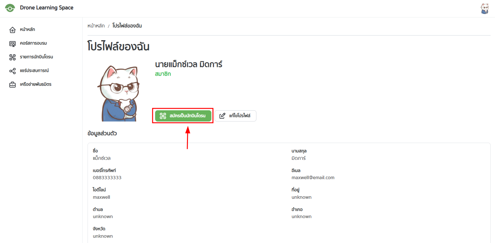
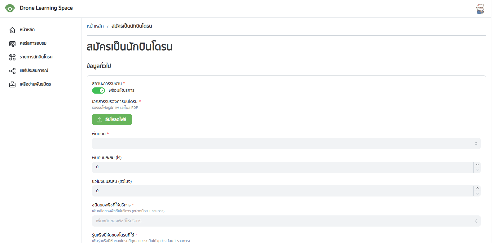
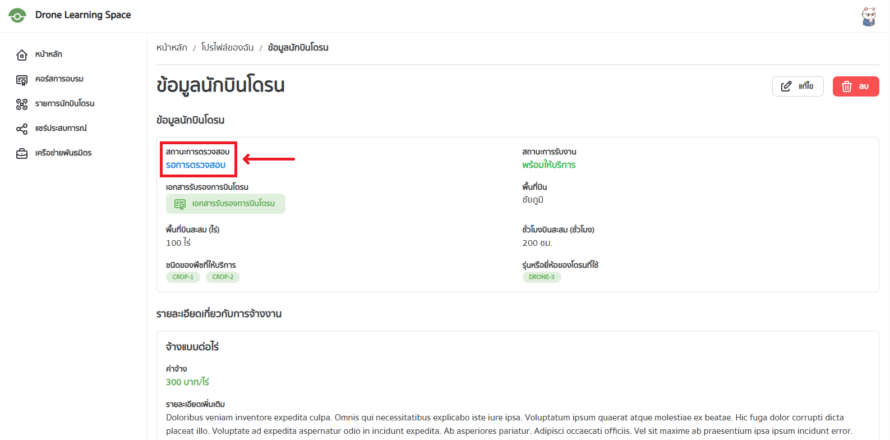
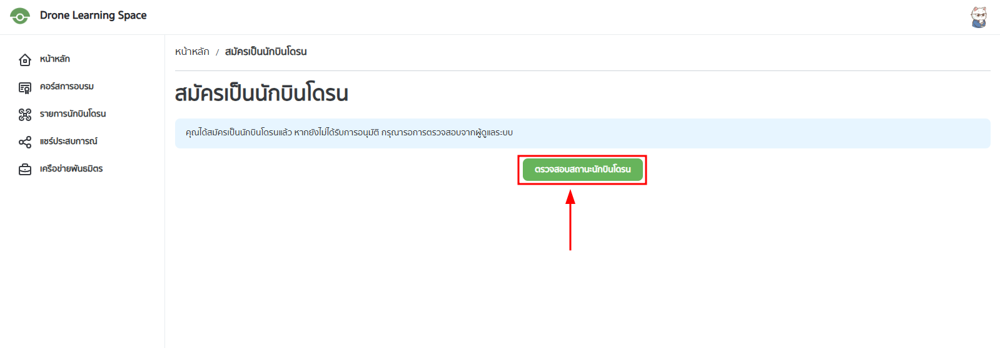
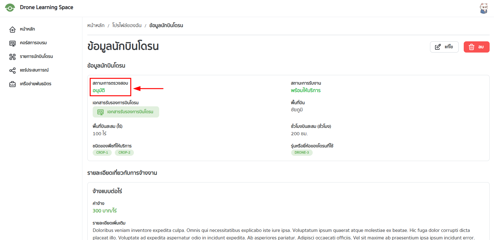
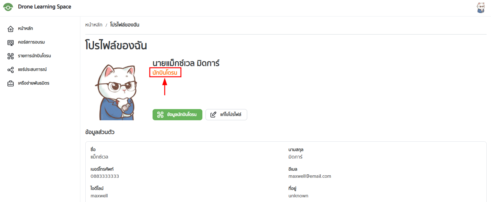
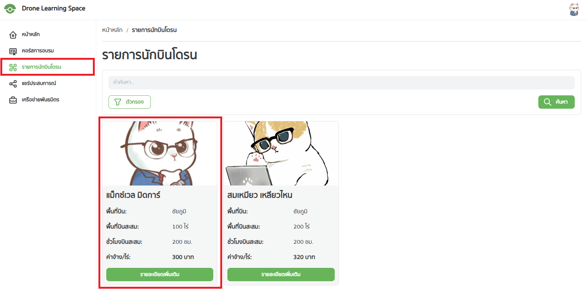
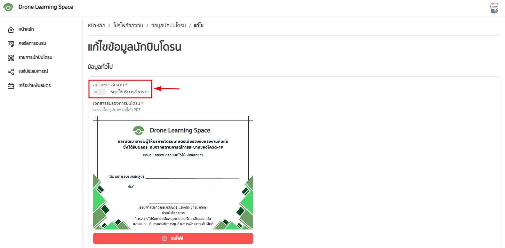
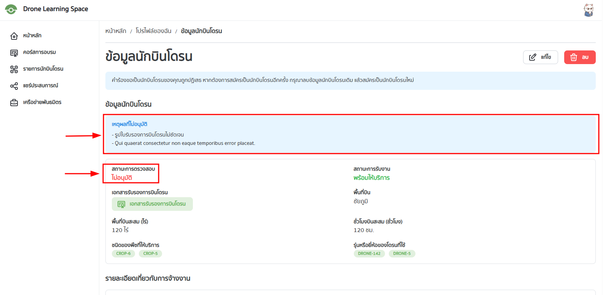

## สมัครเป็นนักบินโดรน

ไปที่หน้าโปรไฟล์ (อ่านเพิ่มเติมได้ที่ [การจัดการโปรไฟล์](./profile))

จากนั้นเลือก "สมัครเป็นนักบินโดรน"

จะปรากฏหน้าดังรูป

ให้กรอกข้อมูลตามที่ระบบต้องการ แล้วกด "บันทึก"

เมื่อกด "บันทึก" แล้ว ระบบจะทำการส่งข้อมูลไปยังผู้ดูแลระบบ และรอการตรวจสอบจากผู้ดูแลระบบ

หน้าที่ปรากฏหลังจากกด "บันทึก" จะแสดงข้อมูลที่กรอกไว้ และสถานะการตรวจสอบ

## ดูสถานะการตรวจสอบ

หลังจากที่ผู้ใช้ทำการสมัครเป็นนักบินโดรนแล้ว สถานะการตรวจสอบจะเป็น "รอการตรวจสอบ"

หากต้องการดูสถานะของการตรวจสอบ ให้ผู้ใช้ไปที่หน้าโปรไฟล์แล้วเลือก "สมัครเป็นนักบินโดรน"

ระบบจะแจ้งว่าผู้ใช้ได้สมัครแล้ว และกำลังรอการตรวจสอบจากผู้ดูแลระบบ ให้เลือก "ตรวจสอบสถานะนักบินโดรน"

จะปรากฏหน้าดังรูป

**ผู้ใช้จะสามารถแก้ไขข้อมูลนักบินโดรนได้ก็ต่อเมื่อได้รับการอนุมัติแล้วเท่านั้น**

หากต้องการแก้ไขข้อมูลนักบินโดรนขณะที่อยู่ในระหว่างรอการตรวจสอบจากผู้ดูแลระบบ ให้ผู้ใช้ลบข้อมูลนักบินโดรน แล้วทำการสมัครใหม่อีกครั้ง

ในทำนองเดียวกัน หากผู้ใช้ต้องการยกเลิกการสมัครเป็นนักบินโดรน ให้ผู้ใช้ลบข้อมูลนักบินโดรน โดยข้อมูลที่ผู้ใช้กรอกไว้จะถูกลบออกจากระบบ ถือว่าผู้ใช้ได้ยกเลิกการสมัครเป็นนักบินโดรนแล้ว

สำหรับการลบข้อมูลนักบินโดรน สามารถอ่านเพิ่มเติมได้ที่ [การลบข้อมูลนักบินโดรน](./drone-owner-profile#การลบข้อมูลนักบินโดรน)

## กรณีที่ได้รับการอนุมัติ

เมื่อผู้ดูแลระบบทำการตรวจสอบแล้ว สถานะการตรวจสอบจะเปลี่ยนเป็น "อนุมัติ"

หากมาที่หน้าโปรไฟล์ จะพบว่าบทบาทของผู้ใช้จะเปลี่ยนเป็น "นักบินโดรน"

ข้อมูลนักบินโดรนของผู้ใช้จะถูกแสดงในหน้ารายการนักบินโดรนดังรูป

หากไม่ต้องการแสดงข้อมูลนักบินโดรนในหน้ารายการนักบินโดรน ให้ผู้ใช้ไปที่หน้าแก้ไขข้อมูลนักบินโดรน เลือก "สถานะการรับงาน" เป็น "หยุดให้บริการชั่วคราว" แล้วกด "บันทึก"

สำหรับการจัดการโปรไฟล์นักบินโดรน สามารถอ่านเพิ่มเติมได้ที่ [การจัดการโปรไฟล์นักบินโดรน](./drone-owner-profile)

## กรณีที่ไม่ได้รับการอนุมัติ

หากไม่ได้รับการอนุมัติ สถานะการตรวจสอบจะเปลี่ยนเป็น "ไม่อนุมัติ" พร้อมแสดงเหตุผลที่ไม่อนุมัติ (หากมี)

ผู้ใช้สามารถสมัครเป็นนักบินโดรนใหม่ได้ โดยลบข้อมูลนักบินโดรนเดิมออกจากระบบ แล้วทำการสมัครใหม่อีกครั้ง

สำหรับการลบข้อมูลนักบินโดรน สามารถอ่านเพิ่มเติมได้ที่ [การลบข้อมูลนักบินโดรน](./drone-owner-profile#การลบข้อมูลนักบินโดรน)
