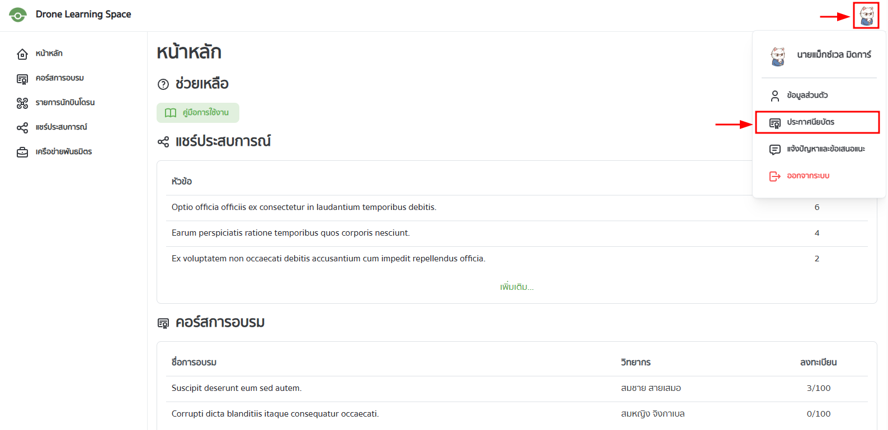
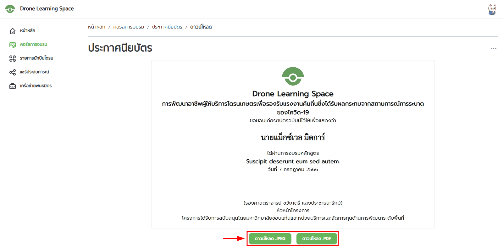

ผู้ใช้จะมีสิทธิรับประกาศนียบัตรก็ต่อเมื่อทำแบบทดสอบของคอร์สการอบรมนั้น ๆ และได้รับคะแนนผ่านเกณฑ์ที่กำหนดไว้

# ดูประกาศนียบัตร

ผู้ใช้สามารถดูประกาศนียบัตรของตนเองได้โดยเลือกที่รูปโปรไฟล์ขวาบน จะมีหน้าต่างเมนูขึ้นมา จากนั้นเลือกประกาศนียบัตร

จะพบกับหน้าประกาศนียบัตร ซึ่งจะแสดงรายการประกาศนียบัตรทั้งหมดของผู้ใช้ที่ได้รับในแต่ละคอร์สการอบรม

ผู้ใช้สามารถเลือกดูประกาศนียบัตรของคอร์สการอบรมที่ต้องการได้ และสามารถดาวน์โหลดไฟล์ประกาศนียบัตรได้โดยกดที่ปุ่มดาวน์โหลด

