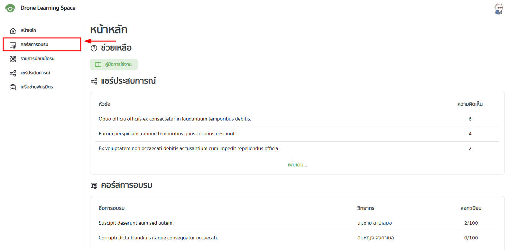
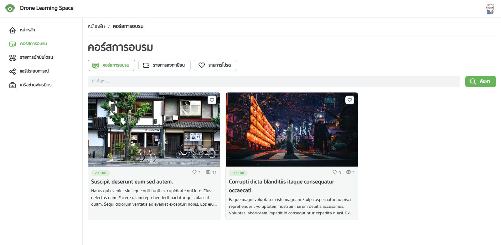
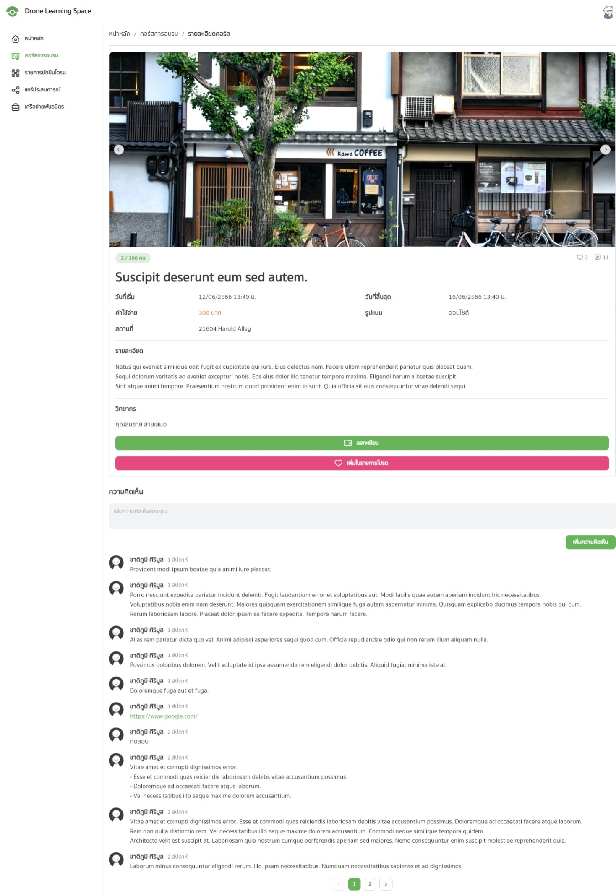
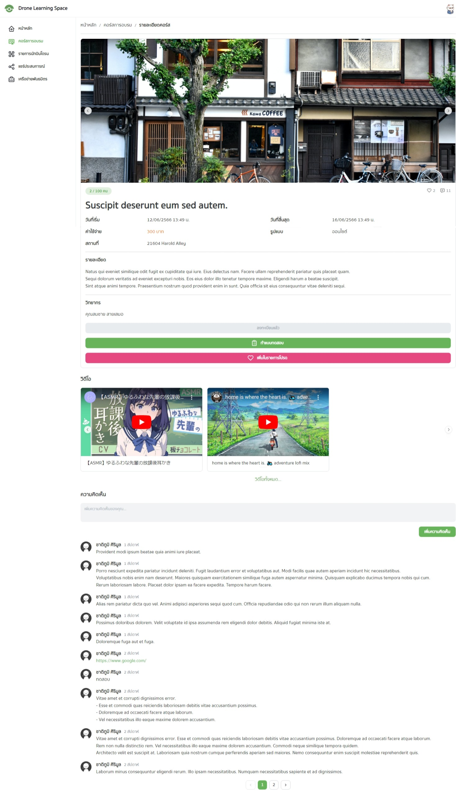
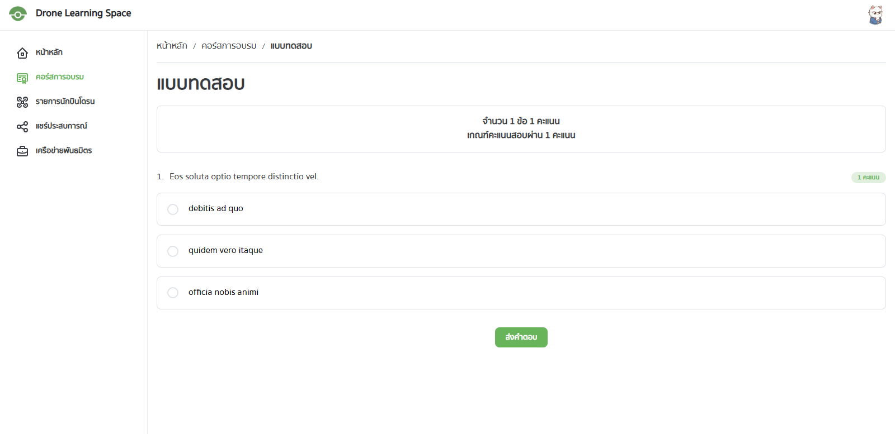

## การค้นหาคอร์สการอบรม

ไปที่หน้าคอร์สการอบรม โดยเลือกที่เมนูด้านซ้ายมือ

จะพบกับหน้าคอร์สการอบรม โดยจะแสดงรายการคอร์สการอบรมทั้งหมดที่มีในระบบ

ผู้ใช้สามารถ:

- เลือกดูคอร์สทั้งหมด คอร์สที่ลงทะเบียน และคอร์สที่อยู่ในรายการโปรดได้
- ค้นหาคอร์สได้
- เพิ่มคอร์สเข้าไปในรายการโปรดได้
- กดเพื่อดูรายละเอียดคอร์สได้

## การลงทะเบียนคอร์สการอบรม

ให้เลือกคอร์สที่ต้องการลงทะเบียน จะปรากฏหน้าคอร์สการอบรม โดยจะแสดงรายละเอียดของคอร์สการอบรมนั้น ๆ

ผู้ใช้สามารถ:

- ลงทะเบียนคอร์สการอบรมได้ โดยเลือกที่ปุ่ม "ลงทะเบียน"
- เพิ่มคอร์สเข้าไปในรายการโปรดได้ โดยเลือกที่ปุ่ม "เพิ่มในรายการโปรด"
- แสดงความคิดเห็นได้

เมื่อลงทะเบียนแล้วผู้ใช้จะสามารถ:

- ทำแบบทดสอบได้
- เข้าถึงลิงก์การอบรมได้
- เข้าถึงลิงก์วิดีโอการอบรมได้ (หากมี)

## การทำแบบทดสอบ

ให้เข้าไปยังหน้ารายละเอียดคอร์สการอบรมที่ต้องการทำแบบทดสอบ จากนั้นลงทะเบียน จากนั้นให้เลือกปุ่ม "ทำแบบทดสอบ"

คอร์สบางคอร์สอาจจะไม่มีแบบทดสอบ หากผู้ดูแลระบบไม่ได้กำหนดให้มีแบบทดสอบ ปุ่ม "ทำแบบทดสอบ" จะไม่ปรากฏ

หลังจากกดปุ่มแล้วผู้ใช้จะพบกับหน้าแบบทดสอบของคอร์สที่เลือก โดยแต่ละคอร์สจะมีขำนวนคำถามและเกณฑ์คะแนนผ่านที่ต่างกันไป

ผู้ใช้สามารถทำแบบทดสอบได้ไม่จำกัดจำนวนครั้ง จนกว่าผู้ใช้จะผ่านแบบทดสอบ

เมื่อผู้ใช้ผ่านแบบทดสอบแล้ว ผู้ใช้จะได้รับประกาศนียบัตร หากคอร์สนั้นมีการออกประกาศนียบัตร

สำหรับประกาศนียบัตร สามารถอ่านเพิ่มเติมได้ที่ [หน้าประกาศนียบัตร](./certificate)
