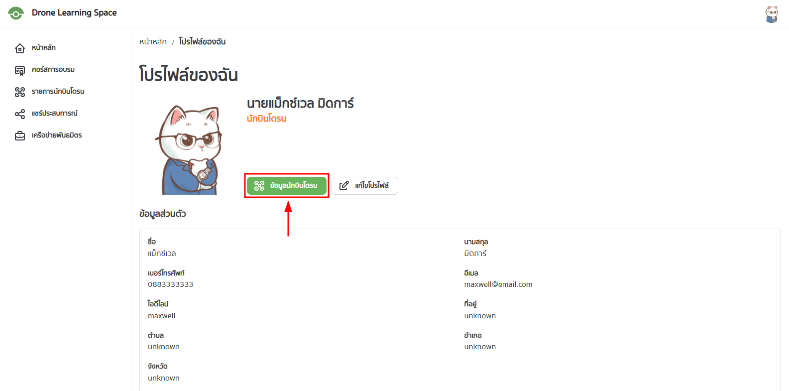
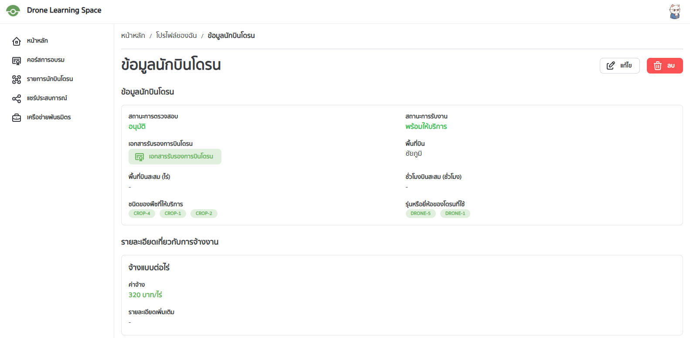
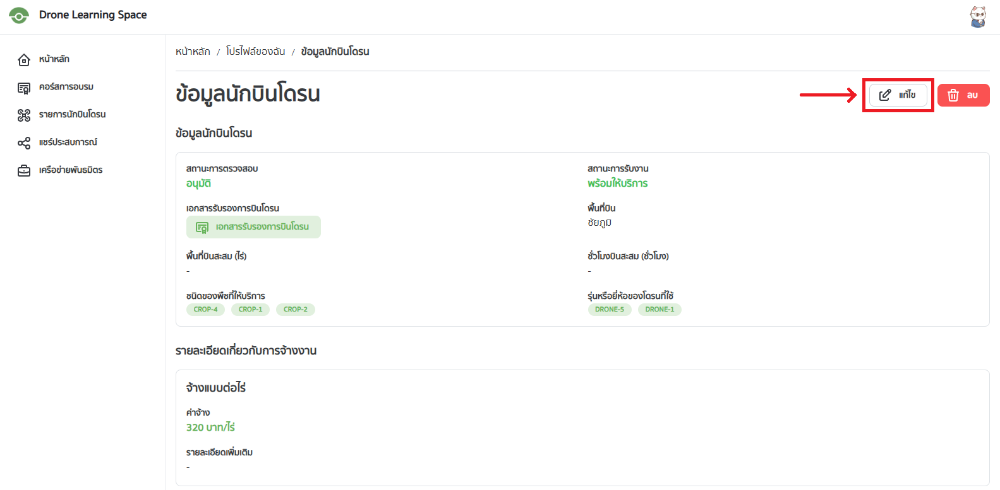
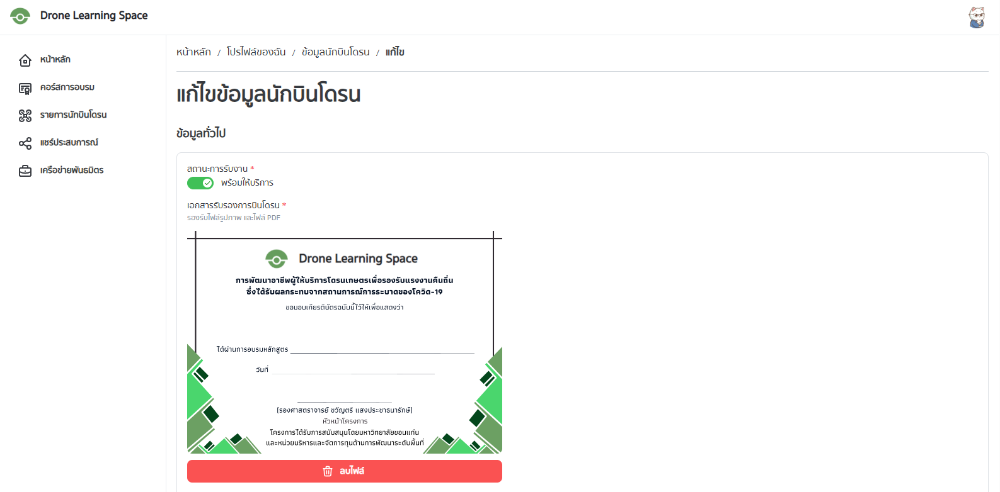
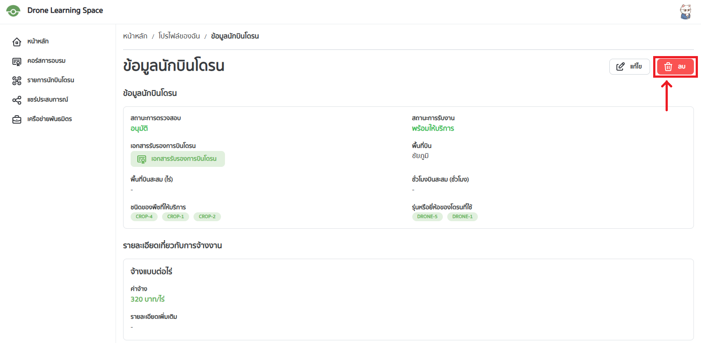

คู่มือนี้สำหรับผู้ใช่ที่เป็นนักบินโดรนเท่านั้น

## การดูข้อมูลนักบินโดรน

ให้ผู้ใช้ไปที่หน้าโปรไฟล์ โดยเลือกที่รูปโปรไฟล์ขวาบนแล้วเลือก "ข้อมูลส่วนตัว"
อ่านเพิ่มเติมได้ที่ [การจัดการโปรไฟล์](./profile)

จากนั้นเลือก "ข้อมูลนักบินโดรน"

จะปรากฏหน้าข้อมูลนักบินโดรนดังรูป

## การแก้ไขข้อมูลนักบินโดรน

จากหน้าข้อมูลนักบินโดรน ให้เลือก "แก้ไข" จากเมนูด้านขวาบน

จะปรากฏหน้าแก้ไขข้อมูลนักบินโดรนดังรูป

เมื่อแก้ไขข้อมูลเรียบร้อยแล้วให้เลื่อนลงมาด้านล่างแล้วกดปุ่ม "บันทึก" เพื่อบันทึกข้อมูล

## การลบข้อมูลนักบินโดรน

จากหน้าข้อมูลนักบินโดรน ให้เลือก "ลบ" จากเมนูด้านขวาบน

เมื่อผู้ใช้ลบข้อมูลนักบินโดรน:

- ข้อมูลนักบินโดรนจะถูกลบออกจากระบบ
- ข้อมูลนักบินโดรนจะไม่สามารถกู้คืนได้
- ข้อมูลนักบินโดรนในหน้ารายการนักบินโดรนจะถูกลบออกจากระบบ
