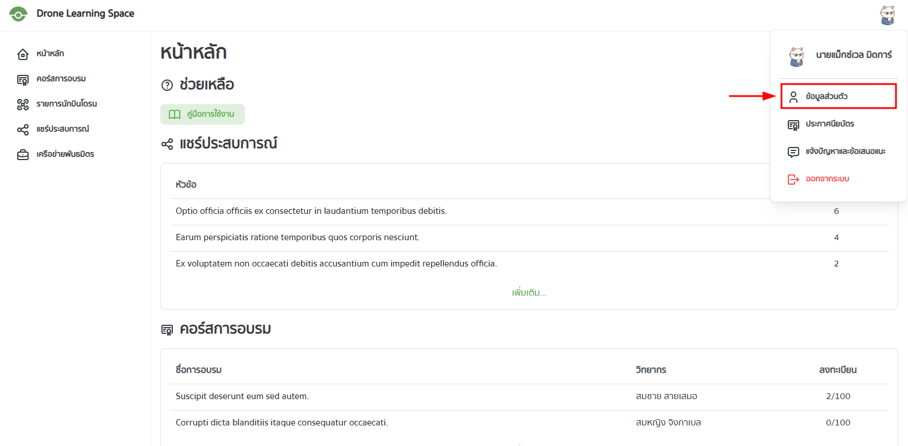

ไปที่หน้าโปรไฟล์ `/profile` หรือคลิกที่รูปโปรไฟล์ด้านบนขวามือและเลือก "ข้อมูลส่วนตัว"

จะปรากฏหน้าต่างดังรูป

ในหน้าโปรไฟล์จะประกอบไปด้วย:

- รูปโปรไฟล์
- ชื่อผู้ใช้
- บทบาท
- ปุ่มสำหรับสมัครเป็นนักบินโดรน และปุ่มสำหรับการแก้ไขโปรไฟล์
- ข้อมูลส่วนตัว

## การแก้ไขโปรไฟล์

เมื่อคลิกที่ปุ่ม "แก้ไขโปรไฟล์" จะปรากฏหน้าต่างดังรูป

ผู้ใช้สามารถแก้ไขข้อมูลส่วนตัวได้ตามต้องการ เมื่อแก้ไขเสร็จแล้วให้เลื่อนลงมาด้านล่างแล้วกดปุ่ม "บันทึก" เพื่อบันทึกการแก้ไข
