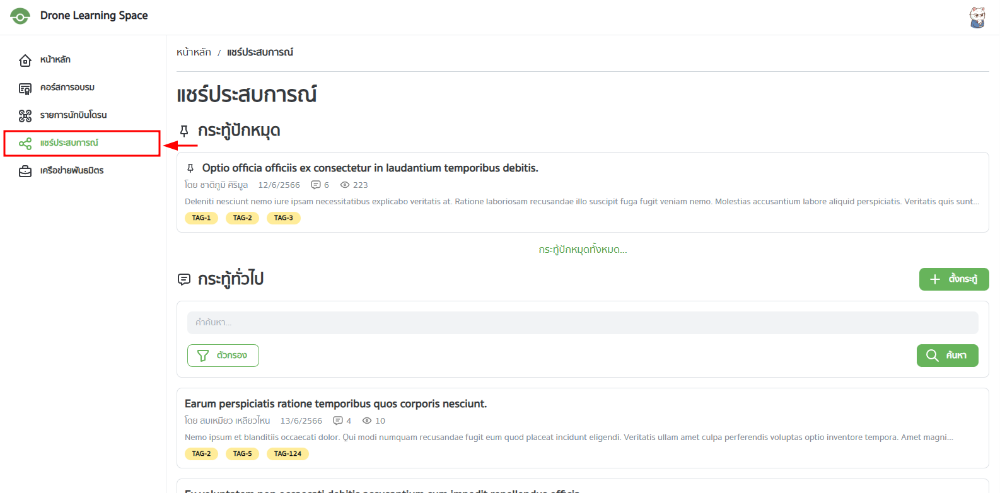
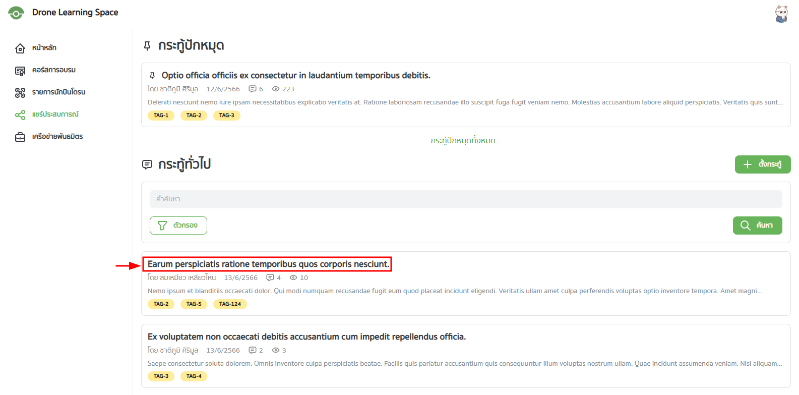
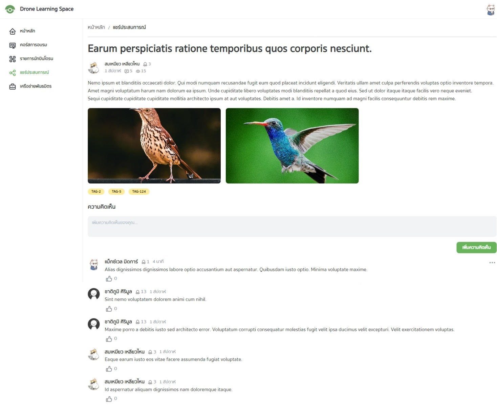

ผู้ใช้สามารถแชร์ประสบการณ์ เรื่องราว หรือถามคำถามต่าง ๆ ได้ผ่านการสร้างกระทู้และการแสดงความคิดเห็น

## ดูกระทู้แชร์ประสบการณ์

เลือก "กระทู้แชร์ประสบการณ์" จากเมนูด้านซ้ายมือ

จะพบกับหน้าแชร์ประสบการณ์ โดยจะแสดงส่วนของกระทู้ที่ถูกปักหมุดโดยผู้ดูแลระบบ และกระทู้ทั่วไป

ผู้ใช้สามารถค้นหากระทู้ได้โดยใช้ช่องค้นหาพร้อมกับตัวกรองในการค้นหา

ผู้ใช้สามารถเลือกที่ชื่อของกระทู้เพื่อเข้าไปยังหน้ารายละเอียดของกระทู้ได้

ในหน้ารายละเอียดกระทู้แชร์ประสบการณ์ ผู้ใช้สามารถแสดงความคิดเห็นได้โดยกรอกข้อความในช่อง "เพิ่มความคิดเห็นของคุณ" และกดปุ่ม "เพิ่มความคิดเห็น"

